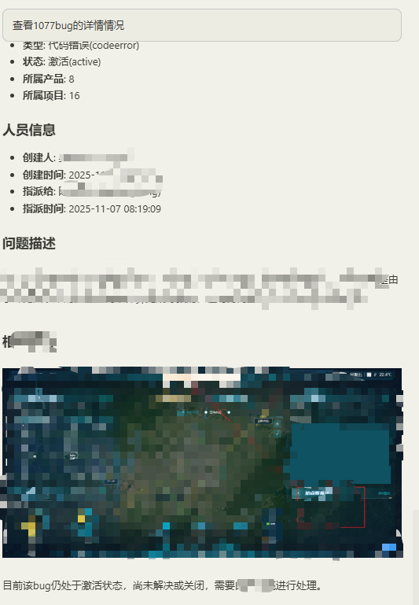

# ZenTao MCP Server

一个用于与禅道项目管理软件集成的 MCP（Model Context Protocol）服务器，提供 Bug 查看、产品管理等功能。

## 功能特性

- 🔐 **用户认证**：自动管理禅道 API 认证 token
- 📦 **产品管理**：获取禅道系统中的产品列表
- 🐛 **Bug 查看**：
  - 查看所有 Bug 列表
  - 根据产品 ID 查看特定产品的 Bug
  - 获取 Bug 详细信息
  - 支持三种图片模式（none/url/base64）
- ✅ **Bug 处理**：标记 Bug 为已解决状态
- 🖼️ **图片处理**：
  - 支持获取禅道 Bug 中的图片
  - 自动上传到图床服务
  - 支持 URL 和 Base64 两种返回模式

## 快速开始

### 安装依赖

```bash
npm install
# 或
pnpm install
```

### 配置环境变量

创建 `.env` 文件并配置以下变量：

```env
# 禅道系统配置
ZENTAO_URL=http://your-zentao-url
ZENTAO_USERNAME=your-username
ZENTAO_PASSWORD=your-password
ZENTAO_API_VERSION=v1

# 图床配置（可选）
IMAGE_BED_URL=https://xxx.com
IMAGE_BED_AUTH=your-auth-code

# 缓存时间（可选，默认5分钟）
CACHE_DURATION=300000
```

### mcp 配置

```javascript
  {
    "command": "node",
      "args": [
        "c:\\xxx\\mcp-server.js"
      ],
      "env": {
        "CACHE_DURATION": "300000",
        "ZENTAO_API_VERSION": "v1",
        "ZENTAO_USERNAME": "xxx"
        "ZENTAO_PASSWORD": "xxx",
        "ZENTAO_URL": "https://xxx.com/zentao",
      }
  }
```

### 使用



## 可用工具

### 1. get_zentao_user_profile

获取当前登录用户的个人信息

### 2. get_zentao_products

获取禅道系统中的所有产品列表

### 3. get_bugs_by_product_id

根据产品 ID 获取该产品下的所有 Bug 列表

**参数：**

- `productId` (number): 产品 ID
- `page` (number, optional): 页码
- `limit` (number, optional): 每页数量

### 4. get_bug_details

根据 Bug ID 获取 Bug 的详细信息

**参数：**

- `bugId` (number): Bug ID
- `imageMode` (enum, optional): 图片模式
  - `none`: 不获取图片（默认）
  - `url`: 获取图片 URL 并上传到图床
  - `base64`: 获取图片并转换为 base64

### 5. view_zentao_bugs

获取并显示禅道系统中的 Bug 列表

**参数：**

- `productId` (number, optional): 产品 ID
- `projectId` (number, optional): 项目 ID
- `userId` (number, optional): 用户 ID
- `status` (string, optional): Bug 状态
- `limit` (number, optional): 返回数量限制

### 6. resolve_zentao_bug

标记指定的禅道 Bug 为已解决

**参数：**

- `bugId` (number): Bug ID
- `resolution` (string): 解决方案
  - `bydesign`: 设计如此
  - `duplicate`: 重复 bug
  - `external`: 外部原因
  - `fixed`: 已解决
  - `notrepro`: 无法重现
  - `postponed`: 延期处理
  - `willnotfix`: 不予解决
  - `tostory`: 转需求
- `duplicateBug` (number, optional): 重复 Bug ID
- `resolvedBuild` (string|number, optional): 解决版本
- `resolvedDate` (string, optional): 解决时间
- `assignedTo` (string, optional): 指派给
- `comment` (string, optional): 备注

## 项目结构

```
.
├── src/
│   ├── zentao-api.js       # 禅道API核心模块
│   └── image-processor.js  # 图片处理模块
├── config.js               # 配置文件
├── mcp-server.js          # MCP服务器主入口
├── package.json           # 项目配置
└── README.md              # 项目说明
```

## 代码优化

### 模块化架构

- **zentao-api.js**: 封装所有禅道 API 调用，包含 Token 缓存管理和自动重试机制
- **image-processor.js**: 专门处理图片获取、转换和上传逻辑
- **mcp-server.js**: MCP 服务器主入口，简洁清晰

### 代码质量

- ✅ 消除重复代码
- ✅ 提取通用错误处理逻辑
- ✅ 模块化设计，易于维护
- ✅ 详细的代码注释
- ✅ 符合最佳实践

## 许可证

ISC
